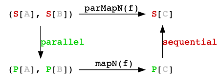

# Chapter 3. Parallel execution

## Does `IO` support parallelism?

No.

IO doesn’t support parallelism, we need a new type that does. In `cats.effect`, this type is named `IO.Par` (Par for “parallel”).

```scala
val ia: IO[A] = IO(???)
val ib: IO[B] = IO(???)

def f(a: A, b: B): C = ???

val ipa: IO.Par[A] = IO.Par(ia)
val ipb: IO.Par[B] = IO.Par(ib)

val ipc: IO.Par[C] = (ipa, ipb).mapN(f)

val ic: IO[C] = IO.Par.unwrap(ipc)
```

## `parMapN`

`parMapN` translates the arguments ia and ib to `IO.Par` values, composing them in parallel via `IO.Par` and `mapN`, and translates the results back to `IO`.

```scala
val ia: IO[A] = IO(???)
val ib: IO[B] = IO(???)

def f(a: A, b: B): C = ???

val ic: IO[C] = (ia, ib).parMapN(f)
```



`mapN` and `parMapN` act on tuples of any arity, so we can combine any number of
effects together in a consistent way

## `parTupled`

```scala
(ia, ib).parTupled // 1
(ia, ib, ic).parTupled // 2
(ia, ib, ic, id).parTupled // 3
```

1. Two `IO` → one `IO` of a `Tuple2`: `(IO[A], IO[B]) ⇒ IO[(A, B)]`
2. Three `IO → one `IO` of a `Tuple3`: `(IO[A], IO[B], IO[C]) ⇒ IO[(A, B, C)]`
3 Four `IO` → one `IO` of a `Tuple4`: `(IO[A], IO[B], IO[C], IO[D]) ⇒ IO[(A, B, C, D)]`
4 And so on.

## `parTraverse`

`parTraverse` is the parallel version of `traverse`; both have the type signature: `F[A] => (A => G[B]) => G[F[B]]`

For example, if `F` is `List` and `G` is `IO`, then `(par)traverse` would be a function from a `List[A]` to an `IO[List[B]]` when given a function `A ⇒ IO[B]`: `List[A] => (A => IO[B]) => IO[List[B]]`

## `parSequence`

`(par)sequence` turns a nested structure “inside-out”: `F[G[A]] => G[F[A]]`

For example, if you have a `List` of `IO` effects, `parSequence` will, in parallel, transform it into one `IO` effect that produces a `List` of outputs: `List[IO[A]] => IO[List[A]]`

## Summary

1. `IO` does not support parallel operations itself, because it is a `Monad`.
2. The `Parallel` typeclass specifies the translation between a pair of effect types: one that is a `Monad` and the other that is “only” an `Applicative`.
3. `Parallel[IO]` connects the `IO` effect to its parallel counterpart, `IO.Par`.
4. Parallel `IO` composition requires the ability to shift computations to other threads within the current `ExecutionContext`. This is how parallelism is “implemented”.
5. `parMapN`, `parTraverse`, `parSequence` are the parallel versions of (the sequential) `mapN`, `traverse`, and `sequence`. Errors are managed in a fail-fast manner.
