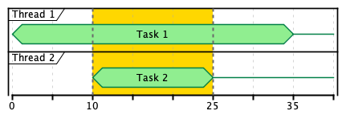

# Chapter 4. Concurrent control

In this chapter we’ll discuss how to fork and join a concurrent effect, cancel a concurrently running effect, and how to race multiple effects concurrently.

concurrent and parallel are disparate concepts.

**concurrenct** Computations are concurrent when their execution *lifetimes* overlap

**parallel** Computations are parallel when their executions occur at the same *instant* in time.

Parallel



Concurrent


## Decomposing the behavior of `parMapN`

```scala
def myParMapN[A, B, C](ia: IO[A], ib: IO[B])(f: (A, B) => C): IO[C]
```

myParMapN, just like parMapN, needs to:

1. start both the `ia` and `ib` computations so they run concurrently (“fork” them);
2. wait for each result;
3. cancel the “other” effect if `ia` or `ib` fails; and
4. finally combine the results with the `f` function.

To start running a computation we use `start`, e.g. `ia.start`, and we receive a `Fiber[IO, A]`.

To wait on a computation, we can call `join` on a `Fiber[IO, A]`:

```scala
for {
  fiberA <- ia.start
  fiberB <- ib.start
  a <- fiberA.join
  b <- fiberB.join
} yield f(a, b)
```

In the end we combine the results with the `f` function. We still need to cancel the other effect if `ia` or `ib` fails. You can call `cancel` on a `Fiber`. The issue is that we have no way to easily cancel on using `onError` using the for-comprehension sequence.

`race` will run two effects concurrently but will give you either the first or the second that completed. The second will be cancelled by `race`. `IO.race` is built on `IO.racePair` which doesn't cancel the losing effect, instead you get both. So instead we can write:

```scala
def myParMapN[A, B, C](ia: IO[A], ib: IO[B])(f: (A, B) => C): IO[C] =
  IO.racePair(ia, ib).flatMap {
    case Left((a, fb)) => (IO.pure(a), fb.join).mapN(f) 1
    case Right((fa, b)) => (fa.join, IO.pure(b)).mapN(f) 1
  }
```
