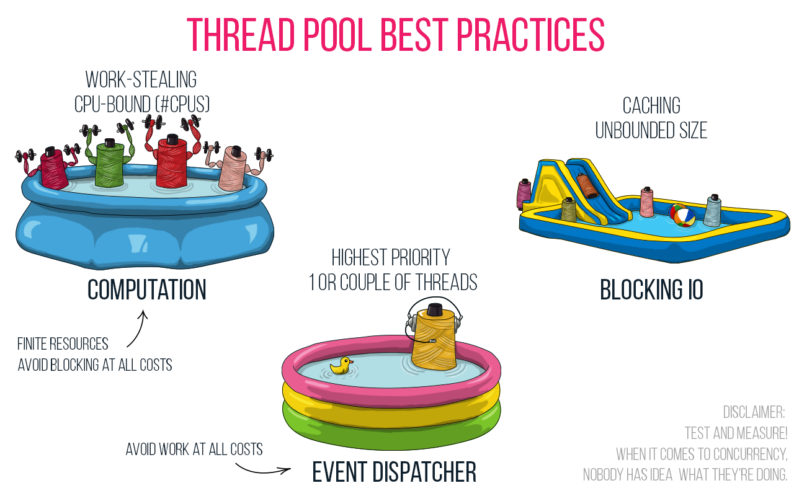
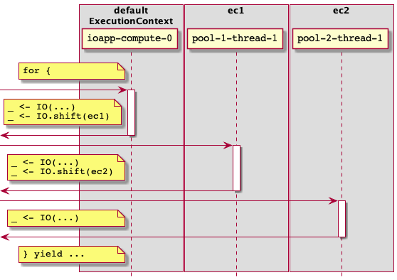

# Chapter 5. Shifting contexts

## Default parallelism

In Cats Effect, every `IOApp` has a default `ExecutionContext`, and on the JVM it is constructed as a fixed pool based on the number of available CPUs. In all of our IOApp-based examples we’ve been using this hidden thread pool.

## The need for multiple contexts

- CPU-bound work should be scheduled on a fixed-size thread pool where the number of threads is the number of cores available to the JVM.
- I/O-bound work should be scheduled on an *unbounded* thread pool so that blocked threads merely take up memory instead of stopping the progress of other tasks

## Blocking effects

In cats-effect 2 use `Blocker[IO].use` to create a `blocker` and then pass an `IO` to `blocker.blockOn`

In cats-effect 3 you can simply use `IO.blocking` to construct a blocking effect.

## How do we know if something is blocking?

> if something doesn’t have a callback API, then you know it’s blocking

-Daniel Spiewak, Cats Effect gitter.im chatroom

## Finer-grained control of contexts

To have `IO` switch contexts you can use `IO.shift` which will put the computation on a different thread. `IO.shift` will also take an `ExecutionContext`.

